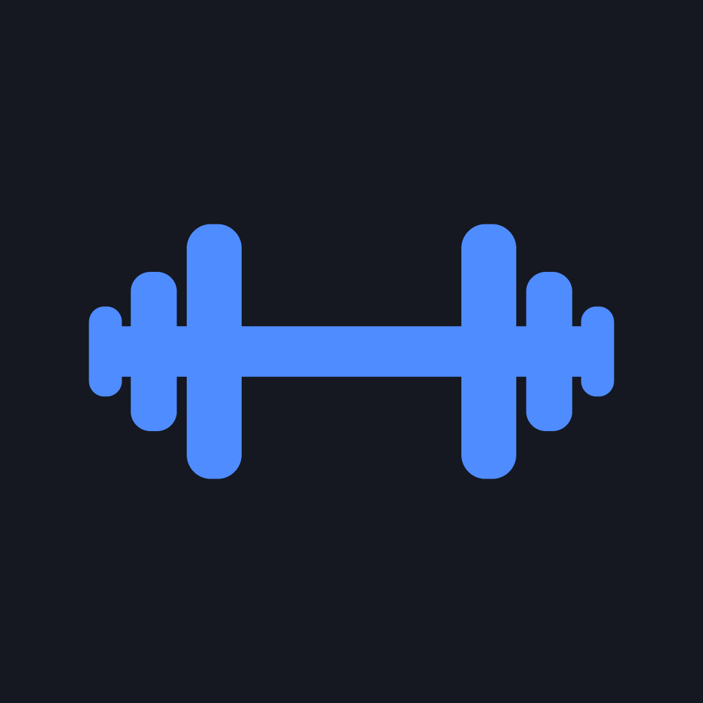
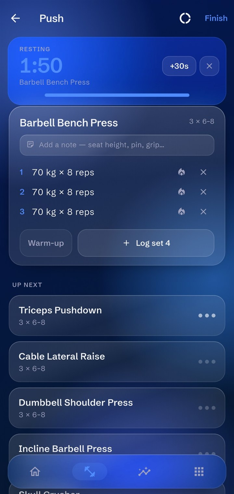
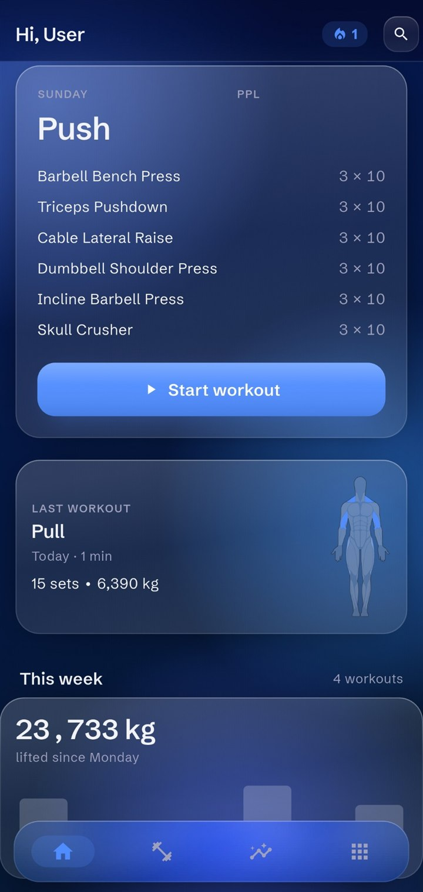
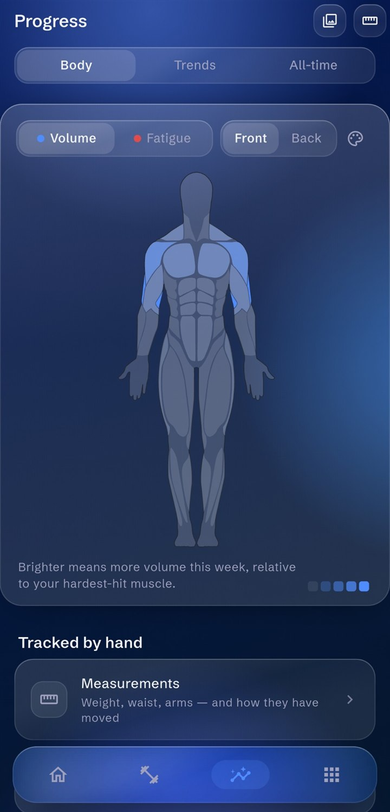
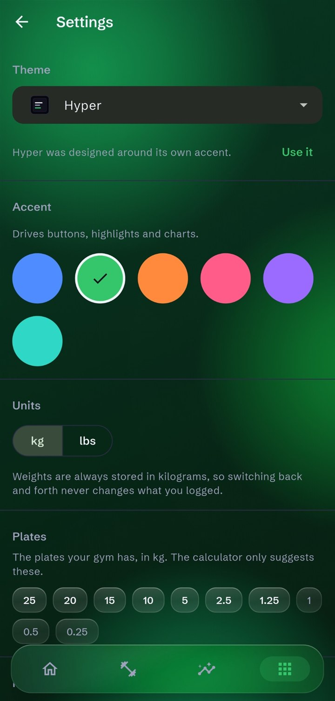

<p align="center">
  
</p>

<h1 align="center">Gymfy</h1>

<p align="center">
  <b>A gym log that lives on your phone, and only on your phone.</b><br>
  Plan your split, log your sets, watch the numbers move.<br>
  No account. No ads. No internet permission.
</p>

<p align="center">
  <a href="https://github.com/Joshynaldo/Gymfy/releases/latest"><b>Download the APK</b></a> ·
  <a href="https://joshynaldo.github.io/Gymfy/">Website</a> ·
  <a href="https://joshynaldo.github.io/Gymfy/privacy-policy.html">Privacy policy</a>
</p>

<p align="center">
  
  
  
  
</p>

---

## Availability

| Platform | Status |
|---|---|
| **Android** | Released. Get the APK from [GitHub Releases](https://github.com/Joshynaldo/Gymfy/releases/latest). Needs Android 7.0 or newer. |
| **Wear OS** | Companion app for the watch, see [On your wrist](#on-your-wrist). |
| **Google Play** | Coming soon. |
| **App Store** | Coming soon. |

Gymfy is free and will stay free: no subscription, no pro tier, nothing to unlock.

---

## What it can do

### Plan
- **Splits built from workout days.** Put exercises into each day with target
  sets and rep ranges, then pin days to weekdays.
- **One active split.** The Workout tab opens straight on today's day instead of a
  list you have to dig through.
- **Ready-made programs.** Six bundled plans to start from: Beginner Full Body,
  Full Body 5×5, Upper / Lower, Push / Pull / Legs, Percentage Strength and a
  Body-Part Split. Adding one makes it a normal split you can edit.
- **Reorder and superset.** Drag exercises into order and pair neighbours into
  supersets. The rest timer only starts after the last exercise of a superset.
- **% of 1RM targets.** Plan a lift at, say, 75 % of your max and Gymfy works out
  the weight from your tested or estimated 1RM, rounded to what your plates can
  make.
- **Training blocks.** Set a number of training weeks, then a deload week at a
  lighter load. The split shows which week you're in, and the deload week is
  kept out of your progression.
- **Share plans.** Send your splits as a `.gymfy` file or a printable PDF, or
  import someone else's. Supersets and % targets come along. Only plan data goes
  into the file: a test makes sure no session, measurement or photo can end up
  in it.

### Log
- **A keypad built for one hand.** Big keys where your thumb already is, and no
  system keyboard full of letters you'll never need for a weight.
- **Build the weight from plates.** Tap the plates that are on the bar and Gymfy
  adds up the total, with the bar weight set per exercise.
- **Repeat the last set** with one tap when nothing changed.
- **Set types.** Mark a set as warm-up, working, drop or failure. Every set
  counts towards volume and the muscle map, but warm-ups and drop sets stay out
  of your 1RM, PRs, charts and overload suggestions.
- **RPE or RIR**, if you want it. Switch effort rating on in Settings and rate
  each set. A top set rated as a limit effort holds the weight instead of
  going up.
- **A warm-up calculator** that ramps up to your working weight using the
  plates you have, and logs the ramp as warm-up sets.
- **New PRs as they happen.** A set that beats a record gets a celebration
  right away, and the summary lists every record from the session.
- **Change the workout as you go.** Add, swap, reorder or remove exercises
  mid-session, or start an empty workout and build it as you train. A swap can
  also be saved to the plan.
- **Timed exercises** like planks, dead hangs and carries are logged in minutes and
  seconds, with records measured in time.
- **Notes on each exercise** for seat settings, grip width or what your back said
  last time.
- **A rest timer** that shows a countdown ring, adds 30 seconds on a tap, and
  sends a notification with optional vibration once the phone is back in your
  pocket.
- **A workout notification** on Android that stays up while you train: the
  exercise, which set you're on and the rest countdown, with buttons to log the
  suggested set, add 30 seconds or skip the rest. "Log set" only appears when
  Gymfy has real numbers to log, never a made-up first set. It can be switched
  off in Settings.
- **A workout summary** when you finish.

### See your progress
- **A muscle map** shaded by how much volume each muscle got this week, with a
  second view for fatigue: how much is still recovering, fading on a 48-hour
  half-life. Male and female body diagrams.
- **A year of activity** in a GitHub-style heatmap, plus your training streak.
- **A training calendar** month by month. Tap a day to see what you did and open
  the workout.
- **Charts** for volume, workout frequency and muscle groups over a week, a month
  or a year.
- **Monthly review and Year in Training.** Workouts, volume, time trained, top
  exercises, records and most-trained muscles, compared with the month or year
  before. Share one as an image.
- **Goals.** Lift a weight on an exercise by a date, train a number of times a
  week, or reach a bodyweight. Progress fills in from what you log, shows on
  Home, and gets a small celebration when you get there.
- **Per-exercise progress** for top set, volume and estimated 1RM, with dated
  personal records.
- **Body measurements** with history charts, and **progress photos** with a
  side-by-side comparison.

### Decide what to lift
- **Progressive overload.** Gymfy looks at your last session and fills in the
  next weight. Hit your reps and it goes up, fall short and it stays put. You set
  the increment and the rules.
- **Plate calculator** that only uses the plates your gym actually has.
- **1RM calculator** that works from any set.
- **Strength rank** comparing your big lifts to your bodyweight.

### On your wrist
The **Wear OS companion** shows the workout that's running, your set count, the
current exercise and the rest countdown, with a double buzz when rest is over.
From the watch you can add 30 seconds, skip the rest or repeat your last set,
or log the next set: the watch shows the suggested weight and reps (seconds
for a hold), you adjust them with − / + or the rotating crown, and the phone
checks the set before saving it. The phone stays in charge of all the data,
and the watch talks to it directly over the Wearable Data Layer, not through
the internet.

### Your data stays yours
- **Everything stays on the phone.** Your data lives in a SQLite database on the
  device. There's no account, backend or cloud sync, and the app doesn't even
  ask for the internet permission.
- **Health Connect, if you want it** (Android). Off until you switch it on in
  Settings, one switch per direction: finished workouts are written to Health
  Connect as strength-training sessions, so they show up next to your other
  fitness data, and weigh-ins saved there fill in your bodyweight on days you
  haven't entered one. Health Connect is a store on the phone itself, so this
  still needs no internet permission.
- **Import your history** from Hevy, Strong or StrengthLog CSV exports. Gymfy even
  rebuilds your split from it and puts each day on the weekday you usually
  train it.
- **Back up and restore.** One `.gymfy-backup` file holds your whole database
  and your progress photos, and restoring it brings everything back, on this
  phone or a new one. Automatic backups can run weekly or after each workout
  into a folder you pick, keeping the newest 10.
- **Export everything** to CSV or JSON at any time, for spreadsheets or other
  apps.
- **About 1,270 built-in exercises** covering 18 muscle groups, including
  cardio and plyometrics, each with an animated preview. Add as many of your
  own as you like.

---

## Design

Dark-mode first, with a user-chosen accent colour that drives every CTA,
highlight, active state and chart series. Eight themes ship:

| | |
|---|---|
| **Dark** | The default. Near-black with soft grey cards. |
| **AMOLED black** | True black, so a black pixel is an off pixel. |
| **High contrast** | White text, brighter secondary text, visible borders. |
| **Tokyo Night**, **Dracula**, **Catppuccin Mocha**, **Gruvbox** | The editor palettes, using each project's own published values. |
| **Hyper** | The glass one. |

Hyper is the only theme that's a *construction* rather than a palette. Every
surface is translucent and blurs what's behind it, which only works because
there's something behind it to blur: the app paints a slow atmospheric field
under the whole screen. Glass over a flat black background is just a slightly
different grey — the backdrop isn't decoration, it's the half of the effect that
makes the other half read.

The seven flat themes are unaffected by any of it, which is enforced by tests
rather than by hoping.

---

## Getting started

You'll need [Flutter](https://docs.flutter.dev/get-started/install) **3.44.7 or
newer** (Dart SDK `^3.12.2`) and an Android device or emulator on **Android 7.0
(API 24)** or above.

The Flutter app lives in the `gymfy/` subdirectory, not at the repo root.

```bash
git clone https://github.com/Joshynaldo/Gymfy.git
cd Gymfy/gymfy
flutter pub get
dart run build_runner build --delete-conflicting-outputs
flutter run
```

The `build_runner` step is not optional: Riverpod providers, Drift's database
code and Freezed models are all generated, and the project will not compile
without it. Re-run it after touching a `@riverpod` provider, a Drift table or a
Freezed class — or leave `dart run build_runner watch --delete-conflicting-outputs`
running while you work.

### Tests

```bash
flutter test
```

Around 1,970 tests across 158 files. They're the main reason the app can be
refactored at all: as well as the usual unit coverage, there are widget tests
for every screen, layout tests that fail on a pixel of overflow, and a couple
that rasterise a widget and read the pixels back — because "the card looks
black" turned out to be a question about paint order that the widget tree
answered incorrectly for three rounds.

### Other platforms

Android is the main target, and `android/wear/` holds the Wear OS companion
(Kotlin and Compose for Wear OS). The watch app isn't part of `flutter build apk`;
build it on its own with `./gradlew :wear:assembleDebug` from `gymfy/android/`.

An App Store release is on the way. The `macos/`, `linux/`, `windows/` and `web/`
directories are Flutter's defaults and are not maintained. Drift only runs on
native platforms, so the web build can't reach the database at all.

---

## Project layout

```
gymfy/
  lib/
    main.dart
    app/
      router/            go_router, with a StatefulShellRoute per tab
      theme/             ThemeData, the glass material, accent provider
    features/            one folder per feature: providers, widgets, screens
      calculator/          1RM estimates and strength rank
      calendar/            the month-by-month training calendar
      calories/            calorie log (moving out into its own app)
      data_export/         export everything to a file
      exercises/           library, seed data, GIF previews
      goals/               lift, weekly and bodyweight goals
      health_connect/      workouts out to, weigh-ins in from Health Connect
      help/                about the app
      home/                today's workout, streak, activity heatmap
      import/              CSV import from Hevy, Strong and StrengthLog
      more/                the fourth tab's index
      muscle_map/          the body diagram and its two readings
      onboarding/          first-run questions
      overload/            progressive-overload suggestions
      plan_share/          .gymfy and PDF export, and import
      plates/              plate calculator and plate inventory
      progress/            measurements, photos, per-exercise charts
      reviews/             monthly and yearly reviews, shared as an image
      settings/            accent, themes, units, rest timer
      stats/               the panels Progress is assembled from
      wear/                the phone side of the Wear OS sync
      workout/             splits, days, sessions, set logging
      workout_notification/ the ongoing notification while a workout runs
    shared/
      data/                cross-feature providers
      database/            the Drift database
      models/              Drift tables
      utils/               formatting, search, units
      widgets/             the shared UI vocabulary
  assets/
    exercises/           one GIF per exercise, named <id>.gif
    fonts/               Schibsted Grotesk (the Hyper theme's typeface)
    icon/                launcher icon and splash source art
    musclemap/source/    the licensed anatomy pack the diagrams come from
    svg/                 muscle map body diagrams, paths tagged per muscle
  test/
  tool/                  one-off generators, not shipped in the APK
```

Four tabs — **Home**, **Workout**, **Progress**, **More** — each with its own
navigation stack, so switching tabs never loses where you were in another one.

### Conventions

- One feature, one folder, with its own providers, widgets and screens.
- Riverpod with code generation (`@riverpod`); Drift tables in `shared/models/`.
- The accent comes from `ref.watch(accentColorProvider)` — never
  `Theme.of(context).colorScheme.primary`, because the accent and the theme are
  independent by design.
- Widgets never hardcode a hex value. Colours come from the theme or the accent
  provider. `app/theme/` is the one place raw hex is allowed, because that file
  *is* the theme.
- The database schema is versioned (currently v27) and every change ships a
  migration. Existing logs are never dropped.

---

## Tooling

Scripts in `gymfy/tool/`, run with `dart run tool/<name>.dart`:

| Script | What it does |
|---|---|
| `build_muscle_map.dart` | Generates the tagged body SVGs from the licensed source pack. |
| `check_exercise_gifs.dart` | Reports which seeded exercises are still missing a GIF. |
| `sync_exercise_db.dart` | Generates the built-in exercise list from ExerciseGymGifsDB and downloads a preview for each one. |
| `generate_icon.dart` | Produces the launcher-icon and splash source artwork. |

Icons and the splash screen are regenerated with `dart run flutter_launcher_icons`
and `dart run flutter_native_splash:create`.

## Releases

`.github/workflows/release-apk.yml` builds a release APK and attaches it to a
GitHub release. It's triggered manually, and takes an optional tag, release
notes and a pre-release flag; with no tag it uses the version from
`pubspec.yaml`.

---

## Licence

Copyright (C) 2026 Joshua Mitry

Gymfy is free software, released under the **GNU Affero General Public
License v3.0** — see [`LICENSE`](LICENSE). You may use, study, modify and
redistribute it, as long as every version you distribute, or run as a
network service, is made available under the same licence with its full
source. Closed-source forks are not permitted.

Because Apple's App Store terms conflict with the AGPL, the copyright holder
grants an additional permission under section 7 that allows distribution
through the App Store. It is in [`LICENSE-EXCEPTION`](LICENSE-EXCEPTION) and
waives none of the source-code obligations.

## Third-party assets

The AGPL covers the code of this project. The following bundled materials are
**not** covered by it and keep their own terms:

- **Schibsted Grotesk** — SIL Open Font License 1.1. The licence text ships
  alongside the files in `assets/fonts/OFL.txt`. Bundled rather than fetched
  through `google_fonts` so the app looks the same offline.
- **Body diagrams** — `assets/svg/body_*.svg` are generated by
  `tool/build_muscle_map.dart` from a purchased anatomy pack (Envato/CodeCanyon
  item 39853847, Regular License). The generated files are a permitted
  derivative and ship with the app; the original pack is not in this
  repository and must not be redistributed. The Regular License also requires
  the app to stay free of charge. Details in `gymfy/assets/musclemap/README.md`.
- **Exercise animations** — the GIF previews in `assets/exercises/` are used
  with the written permission of their upstream author and are credited on the
  Help screen. That permission does not transfer under the AGPL; if you
  redistribute a modified Gymfy, clear their use yourself or replace them.
